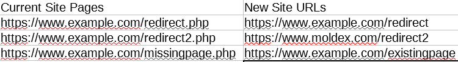
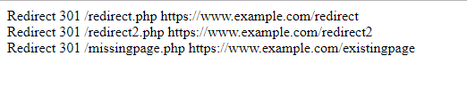

# 301 Redirect Parser

* [Installation](#installation) 
* [Usage](#usage) 
* [Methods](#methods) 
* [Example Csv](#example-csv)
 
This library lets you create lists of url redirects from csv file.

# Installation

## Using composer 

Use the package manager [composer](https://getcomposer.org/) to install the package.

```bash
composer install oguz-yilmaz/Parser
```

## Usage

```php
require "vendor/autoload.php";

$file = new Parser\File("urls.csv");
$parser = new Parser\Parser($file, new Parser\ApacheStrategy());

$parser->setRedirectColumns([1,3])
	   ->setMainUrl("https://www.example.com")
	   ->parse()
	   ->_toString();
```
## Example csv file  
  

## Example Output  
 

# Methods

## setRedirectColumns()
This is the columns in the csv files.It accepts array with length 2. First element of the array will represent the column of the urls that will be redirected to the urls in the column represented by the second element in the array.

## setMainUrl()
Sets the main url of the site so that you can get and use in execute() method of the strategy you are using.  
Here is an example strategy that uses main url:
```php
class ApacheStrategy implements StrategyInterface{

	/**
	 * @param $pathFrom
	 * @param $pathTo
	 * @param string $mainUrl
	 *
	 * @return string
	 */
	public function execute( $pathFrom, $pathTo, $mainUrl="" ) {

		return "Redirect 301 $pathFrom $mainUrl$pathTo";

	}

}

```
## Definin your own custom Strategy class
You should implement the __Parser\StrategyInterface__ interface:

```php

class CustomStrategy implements Parser\StrategyInterface{

	public function execute( $pathFrom, $pathTo, $mainUrl="" ) {

		return "your redirect strategy for each of url";

	}

}

$file = new Parser\File("urls.csv");
$parser = new Parser\Parser($file, new CustomStrategy ());

$parser->setRedirectColumns([1,3])
       ->setMainUrl("https://www.example.com")
       ->parse()
       ->_toString();
```


